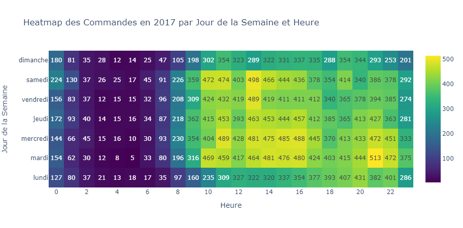

---
# You can also start simply with 'default'
theme: seriph
# random image from a curated Unsplash collection by Anthony
# like them? see https://unsplash.com/collections/94734566/slidev

# some information about your slides (markdown enabled)
title: Projet 5 Openclassrooms
info: |
# apply unocss classes to the current slide
class: text-center
# https://sli.dev/features/drawing
drawings:
  persist: false
# slide transition: https://sli.dev/guide/animations.html#slide-transitions
transition: slide-left
# enable MDC Syntax: https://sli.dev/features/mdc
mdc: true
hideInToc: true
---
# Projet 5 Openclassrooms

Segmentation Client d'un site de e-commerce

<div class="abs-br m-6 flex gap-2">
  <a href="https://openclassrooms.com/fr/projects/1502/mission---segmentez-des-clients-d'un-site-e-commerce" target="_blank" alt="OpenClassrooms" title="OpenClassrooms"
     class="text-xl slidev-icon-btn opacity-50 !border-none !hover:text-white">
    
  </a>
  <a href="https://github.com/dimitri-feniou/openclassrooms-projet5-segmentation-olist" target="_blank" alt="GitHub" title="Open in GitHub"
     class="text-xl slidev-icon-btn opacity-50 !border-none !hover:text-white">
    <carbon-logo-github />
  </a>
</div>


---
transition: fade-out
hideInToc: true
zoom: 0.9
---

# Sommaire 

<Toc minDepth="1" maxDepth="2"></Toc>

---
transition: fade-out
---

# Contexte Projet

Consultant pour olist entreprise brésilienne de mise en relation de vendeur avec des marketplaces
## Objectifs
1. Requêtes SQL pour un tableau de bord sur l'expérience client
2. Analyse exploratoire des clients d'olist
3. Segmentation des clients avec des algorithmes de clustering non supervisés
4. Simulation d'un contrat de maintenant de notre modèle pour assurer son efficacité
<div class="abs-br m-6 flex gap-2">
  <a href="https://openclassrooms.com/fr/projects/1502/mission---segmentez-des-clients-d'un-site-e-commerce" target="_blank" alt="OpenClassrooms" title="OpenClassrooms"
     class="text-xl slidev-icon-btn opacity-50 !border-none !hover:text-white">
    
  </a>
</div>

<style>
h1 {
  background-color: #2B90B6;
  -webkit-background-clip: text;
  -moz-background-clip: text;
  -webkit-text-fill-color: transparent;
  -moz-text-fill-color: transparent;
}

</style>


---
transition: fade-out
---

# Requête SQL pour Dashboard expérience client

````md magic-move

```sql 
-- Question 1 ${1}
SELECT * 
FROM orders
WHERE order_status != 'canceled'
    AND order_purchase_timestamp >= (
        SELECT DATETIME(MAX(order_purchase_timestamp), '-3 months')
        FROM orders
    )
    AND order_estimated_delivery_date > DATETIME(order_delivered_customer_date, '+3 days');
```
```sql 
-- Question 2 ${2}
SELECT s.seller_id,
    SUM(oi.price) as total_sales
FROM sellers s
    JOIN order_items oi ON s.seller_id = oi.seller_id
    JOIN orders o ON oi.order_id = o.order_id
WHERE o.order_status = 'delivered'
GROUP BY s.seller_id
HAVING total_sales > 100000;
```
```sql 
-- Question 3 ${3}
WITH Seller_First_Sale AS (
    SELECT oi.seller_id,
        MIN(o.order_purchase_timestamp) AS first_sale_date
    FROM order_items oi
        JOIN orders o ON oi.order_id = o.order_id
    GROUP BY oi.seller_id
),
Latest_Date AS (
    SELECT MAX(first_sale_date) AS max_date
    FROM Seller_First_Sale
)
SELECT sfs.seller_id,
    sfs.first_sale_date,
    COUNT(oi.product_id) AS total_products_sold
FROM Seller_First_Sale sfs
    JOIN order_items oi ON sfs.seller_id = oi.seller_id
    JOIN Latest_Date ld ON sfs.first_sale_date >= DATETIME(ld.max_date, '-3 months')
GROUP BY sfs.seller_id
HAVING total_products_sold > 30;
```

```sql 
-- Question 4 ${4}
WITH Max_Order_Date AS (
    SELECT MAX(order_purchase_timestamp) AS max_date
    FROM orders
),
Recent_Orders AS (
    SELECT o.order_id,
        c.customer_zip_code_prefix,
        o.order_purchase_timestamp
    FROM orders o
        JOIN customers c ON o.customer_id = c.customer_id
        JOIN Max_Order_Date m ON o.order_purchase_timestamp >= DATETIME(m.max_date, '-12 months')
)
SELECT ro.customer_zip_code_prefix,
    AVG(r.review_score) AS avg_review_score,
    COUNT(ro.order_id) AS total_orders
FROM Recent_Orders ro
    JOIN order_reviews r ON ro.order_id = r.order_id
GROUP BY ro.customer_zip_code_prefix
HAVING total_orders > 30
ORDER BY avg_review_score ASC
LIMIT 5;
```
````

<style>
h1 {
  background-color: #2B90B6;
  -webkit-background-clip: text;
  -moz-background-clip: text;
  -webkit-text-fill-color: transparent;
  -moz-text-fill-color: transparent;
}
</style>

---
transition: fade-out
layout: image
image: './assets/schema_process_segmentation.png'
backgroundSize: contain
---

# Etapes modelisation clustering

<style>

h1 {
  background-color: #2B90B6;
  -webkit-background-clip: text;
  -moz-background-clip: text;
  -webkit-text-fill-color: transparent;
  -moz-text-fill-color: transparent;
}
</style>

---
transition: fade-out
layout: two-cols-header
zoom: 0.9
---
# Analyse Exploratoire des données

::left::

## Informations sur les données


- 9 *tables* Contenant :
  - Informations sur les clients,vendeur,produits,avis
  - Historique de données de **2 ans** 
  - Données sur **100 000 clients**

Analyser les *features* pertinantes pour notre analyse 


::right::
*Exemple: analyse graphique effectuer sur nos données*
<div style="display: flex; flex-direction: column; justify-content: top; align-items: top; height: 90%;">
  
  
</div>

<style>
h1 {
  background-color: #2B90B6;
  -webkit-background-clip: text;
  -moz-background-clip: text;
  -webkit-text-fill-color: transparent;
  -moz-text-fill-color: transparent;
}
</style>