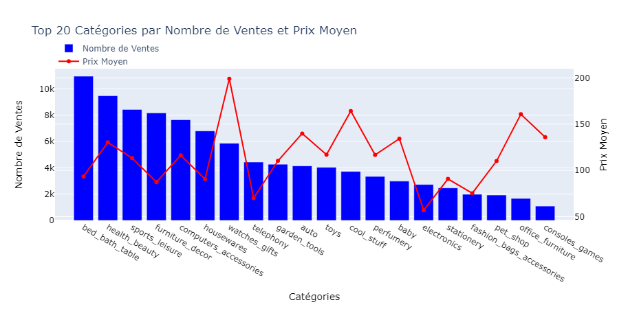

---
# You can also start simply with 'default'
theme: seriph
# random image from a curated Unsplash collection by Anthony
# like them? see https://unsplash.com/collections/94734566/slidev

# some information about your slides (markdown enabled)
title: Projet 5 Openclassrooms
info: |
# apply unocss classes to the current slide
class: text-center
# https://sli.dev/features/drawing
drawings:
  persist: false
# slide transition: https://sli.dev/guide/animations.html#slide-transitions
transition: slide-left
# enable MDC Syntax: https://sli.dev/features/mdc
mdc: true
hideInToc: true
---
# Projet 5 Openclassrooms

Segmentation Client d'un site de e-commerce

<div class="abs-br m-6 flex gap-2">
  <a href="https://openclassrooms.com/fr/projects/1502/mission---segmentez-des-clients-d'un-site-e-commerce" target="_blank" alt="OpenClassrooms" title="OpenClassrooms"
     class="text-xl slidev-icon-btn opacity-50 !border-none !hover:text-white">
    
  </a>
  <a href="https://github.com/dimitri-feniou/openclassrooms-projet5-segmentation-olist" target="_blank" alt="GitHub" title="Open in GitHub"
     class="text-xl slidev-icon-btn opacity-50 !border-none !hover:text-white">
    <carbon-logo-github />
  </a>
</div>


---
transition: fade-out
---

# Contexte Projet

Consultant pour olist entreprise brésilienne de mise en relation de vendeur avec des marketplaces
## Objectifs
1. Requêtes SQL pour un tableau de bord sur l'expérience client
2. Analyse exploratoire des clients d'olist
3. Segmentation des clients avec des algorithmes de clustering non supervisés
4. Simulation d'un contrat de maintenant de notre modèle pour assurer son efficacité
<div class="abs-br m-6 flex gap-2">
  <a href="https://openclassrooms.com/fr/projects/1502/mission---segmentez-des-clients-d'un-site-e-commerce" target="_blank" alt="OpenClassrooms" title="OpenClassrooms"
     class="text-xl slidev-icon-btn opacity-50 !border-none !hover:text-white">
    
  </a>
</div>

<style>
h1 {
  background-color: #2B90B6;
  -webkit-background-clip: text;
  -moz-background-clip: text;
  -webkit-text-fill-color: transparent;
  -moz-text-fill-color: transparent;
}

</style>


---
transition: fade-out
---

# Requête SQL pour Dashboard expérience client

````md magic-move

```sql 
-- Question 1 ${1}
SELECT * 
FROM orders
WHERE order_status != 'canceled'
    AND order_purchase_timestamp >= (
        SELECT DATETIME(MAX(order_purchase_timestamp), '-3 months')
        FROM orders
    )
    AND order_estimated_delivery_date > DATETIME(order_delivered_customer_date, '+3 days');
```
```sql 
-- Question 2 ${2}
SELECT s.seller_id,
    SUM(oi.price) as total_sales
FROM sellers s
    JOIN order_items oi ON s.seller_id = oi.seller_id
    JOIN orders o ON oi.order_id = o.order_id
WHERE o.order_status = 'delivered'
GROUP BY s.seller_id
HAVING total_sales > 100000;
```
```sql 
-- Question 3 ${3}
WITH Seller_First_Sale AS (
    SELECT oi.seller_id,
        MIN(o.order_purchase_timestamp) AS first_sale_date
    FROM order_items oi
        JOIN orders o ON oi.order_id = o.order_id
    GROUP BY oi.seller_id
),
Latest_Date AS (
    SELECT MAX(first_sale_date) AS max_date
    FROM Seller_First_Sale
)
SELECT sfs.seller_id,
    sfs.first_sale_date,
    COUNT(oi.product_id) AS total_products_sold
FROM Seller_First_Sale sfs
    JOIN order_items oi ON sfs.seller_id = oi.seller_id
    JOIN Latest_Date ld ON sfs.first_sale_date >= DATETIME(ld.max_date, '-3 months')
GROUP BY sfs.seller_id
HAVING total_products_sold > 30;
```

```sql 
-- Question 4 ${4}
WITH Max_Order_Date AS (
    SELECT MAX(order_purchase_timestamp) AS max_date
    FROM orders
),
Recent_Orders AS (
    SELECT o.order_id,
        c.customer_zip_code_prefix,
        o.order_purchase_timestamp
    FROM orders o
        JOIN customers c ON o.customer_id = c.customer_id
        JOIN Max_Order_Date m ON o.order_purchase_timestamp >= DATETIME(m.max_date, '-12 months')
)
SELECT ro.customer_zip_code_prefix,
    AVG(r.review_score) AS avg_review_score,
    COUNT(ro.order_id) AS total_orders
FROM Recent_Orders ro
    JOIN order_reviews r ON ro.order_id = r.order_id
GROUP BY ro.customer_zip_code_prefix
HAVING total_orders > 30
ORDER BY avg_review_score ASC
LIMIT 5;
```
````
<div class="abs-br m-6 flex gap-2">
  <a href="https://openclassrooms.com/fr/projects/1502/mission---segmentez-des-clients-d'un-site-e-commerce" target="_blank" alt="OpenClassrooms" title="OpenClassrooms"
     class="text-xl slidev-icon-btn opacity-50 !border-none !hover:text-white">
    
  </a>
</div>

<style>
h1 {
  background-color: #2B90B6;
  -webkit-background-clip: text;
  -moz-background-clip: text;
  -webkit-text-fill-color: transparent;
  -moz-text-fill-color: transparent;
}
</style>

---
transition: fade-out
layout: image
image: './assets/schema_process_segmentation.png'
backgroundSize: contain
---

# Etapes modelisation clustering

<div class="abs-br m-6 flex gap-2">
  <a href="https://openclassrooms.com/fr/projects/1502/mission---segmentez-des-clients-d'un-site-e-commerce" target="_blank" alt="OpenClassrooms" title="OpenClassrooms"
     class="text-xl slidev-icon-btn opacity-50 !border-none !hover:text-white">
    
  </a>
</div>

<style>

h1 {
  background-color: #2B90B6;
  -webkit-background-clip: text;
  -moz-background-clip: text;
  -webkit-text-fill-color: transparent;
  -moz-text-fill-color: transparent;
}
</style>

---
transition: fade-out
layout: two-cols-header
zoom: 0.9
---
# Analyse Exploratoire des données

::left::

## Informations sur les données


- 9 *tables* Contenant :
  - Informations sur les clients,vendeur,produits,avis
  - Historique de données de **2 ans** 
  - Données sur **100 000 clients**

Analyser les *features* pertinantes pour notre analyse 


::right::
*Exemple: analyse graphique effectuer sur nos données*
<div style="display: flex; flex-direction: column; justify-content: top; align-items: top; height: 90%;">
  
  
</div>

<div class="abs-br m-6 flex gap-2">
  <a href="https://openclassrooms.com/fr/projects/1502/mission---segmentez-des-clients-d'un-site-e-commerce" target="_blank" alt="OpenClassrooms" title="OpenClassrooms"
     class="text-xl slidev-icon-btn opacity-50 !border-none !hover:text-white">
    
  </a>
</div>

<style>
h1 {
  background-color: #2B90B6;
  -webkit-background-clip: text;
  -moz-background-clip: text;
  -webkit-text-fill-color: transparent;
  -moz-text-fill-color: transparent;
}
</style>

---
transition: fade-out
---

# Création d'un jeu de données pour modelisation 

**Hypothèse formulée** 
- Regroupé nos données en fonction des commandes des clients `unique_id`
  - Requetâge directement sur notre Base de données (limitation temps traitement)<br>

**Nettoyage des données**
- Suppression des valeurs dupliquées 
- Analyse/suppression des outliers (2750 lignes supprimés)
- Remplacement des valeurs manquantes :
  - Méthode 'Most fréquent values' en fonction de la `catégorie préférée`

<div class="abs-br m-6 flex gap-2">
  <a href="https://openclassrooms.com/fr/projects/1502/mission---segmentez-des-clients-d'un-site-e-commerce" target="_blank" alt="OpenClassrooms" title="OpenClassrooms"
     class="text-xl slidev-icon-btn opacity-50 !border-none !hover:text-white">
    
  </a>
</div>

**Jeu de données obtenu** <br>
96682 lignes et 18 colonnes pour qualifier nos données

<style>
h1 {
  background-color: #2B90B6;
  -webkit-background-clip: text;
  -moz-background-clip: text;
  -webkit-text-fill-color: transparent;
  -moz-text-fill-color: transparent;
}
</style>

---
transition: fade-out
---

# Feature enginerring et selection des Features

**Transformation de variable dans une optique métier**
- `Récence` `Fréquence` `Montant` (analyse de la qualité client)
- Dépenses par commandes clients par catégories :
  - Réduction du nombre de catégories à 10
- `type_de_paiement_préféré` `catégorie_préférée` `jour_avec_plus_de_commandes` par client 

*Extrait jeu de donnée*


<div class="abs-br m-6 flex gap-2">
  <a href="https://openclassrooms.com/fr/projects/1502/mission---segmentez-des-clients-d'un-site-e-commerce" target="_blank" alt="OpenClassrooms" title="OpenClassrooms"
     class="text-xl slidev-icon-btn opacity-50 !border-none !hover:text-white">
    
  </a>
</div>

<style>

h1 {
  background-color: #2B90B6;
  -webkit-background-clip: text;
  -moz-background-clip: text;
  -webkit-text-fill-color: transparent;
  -moz-text-fill-color: transparent;
}
</style>

---
transition: fade-out
---

# Qu'esceque le score RFM ?

Technique qui permet de determiner les habitudes du consommateurs pour mieux cibler les actions marketing à venir <br>

RFM signification : 
- Récence : quelle est la date du dernier achat ?
- Fréquence : quel est le nombre d'achats effectués ?
- Montant : quelle est la somme d'achats cumulées réalisés ?

Le scoring RFM permet grouper les clients en segment

<div class="abs-br m-6 flex gap-2">
  <a href="https://openclassrooms.com/fr/projects/1502/mission---segmentez-des-clients-d'un-site-e-commerce" target="_blank" alt="OpenClassrooms" title="OpenClassrooms"
     class="text-xl slidev-icon-btn opacity-50 !border-none !hover:text-white">
    
  </a>
</div>

<style>

h1 {
  background-color: #2B90B6;
  -webkit-background-clip: text;
  -moz-background-clip: text;
  -webkit-text-fill-color: transparent;
  -moz-text-fill-color: transparent;
}
</style>

---
transition: fade-out
---

# Analyse Scoring RFM sur nos données

<div class="abs-br m-6 flex gap-2">
  <a href="https://openclassrooms.com/fr/projects/1502/mission---segmentez-des-clients-d'un-site-e-commerce" target="_blank" alt="OpenClassrooms" title="OpenClassrooms"
     class="text-xl slidev-icon-btn opacity-50 !border-none !hover:text-white">
    
  </a>
</div>


<style>

h1 {
  background-color: #2B90B6;
  -webkit-background-clip: text;
  -moz-background-clip: text;
  -webkit-text-fill-color: transparent;
  -moz-text-fill-color: transparent;
}
</style>

---
transition: fade-out
---

# Analyse corrélation entre nos variables

<div class="abs-br m-6 flex gap-2">
  <a href="https://openclassrooms.com/fr/projects/1502/mission---segmentez-des-clients-d'un-site-e-commerce" target="_blank" alt="OpenClassrooms" title="OpenClassrooms"
     class="text-xl slidev-icon-btn opacity-50 !border-none !hover:text-white">
    
  </a>
</div>


<style>

h1 {
  background-color: #2B90B6;
  -webkit-background-clip: text;
  -moz-background-clip: text;
  -webkit-text-fill-color: transparent;
  -moz-text-fill-color: transparent;
}
</style>

---
transition: fade-out
---

# Préparation des données pour modelisation 

**Encodage des variables numérique**
- StandardScaler 

**Encodage des variables catégorielles**
- LabelEncoder 


<div class="abs-br m-6 flex gap-2">
  <a href="https://openclassrooms.com/fr/projects/1502/mission---segmentez-des-clients-d'un-site-e-commerce" target="_blank" alt="OpenClassrooms" title="OpenClassrooms"
     class="text-xl slidev-icon-btn opacity-50 !border-none !hover:text-white">
    
  </a>
</div>

<style>

h1 {
  background-color: #2B90B6;
  -webkit-background-clip: text;
  -moz-background-clip: text;
  -webkit-text-fill-color: transparent;
  -moz-text-fill-color: transparent;
}
</style>

---
transition: fade-out
layout: image-right
image: './assets/elbow_kprototypes.png'
backgroundSize: 90%
---

# Modelisation clustering : Test de différents modèles

Modèle Kprototypes 

- Modèle permettant mixer des données numériques et catégorielles
- Test Elbow pour trouver le nombre optimal de cluster

**Modèle non retenu** car il propose un nombre trop restrint de cluster pour analyse marketing

**Methode Elbow Kprototypes**


<div class="abs-br m-6 flex gap-2">
  <a href="https://openclassrooms.com/fr/projects/1502/mission---segmentez-des-clients-d'un-site-e-commerce" target="_blank" alt="OpenClassrooms" title="OpenClassrooms"
     class="text-xl slidev-icon-btn opacity-50 !border-none !hover:text-white">
    
  </a>
</div>

<style>

h1 {
  background-color: #2B90B6;
  -webkit-background-clip: text;
  -moz-background-clip: text;
  -webkit-text-fill-color: transparent;
  -moz-text-fill-color: transparent;
}
</style>

---
transition: fade-out
layout: image-right
image: './assets/elbow_kmeans.png'
backgroundSize: 90%
---

# Modelisation clustering : Test de différents modèles
Kmeans

- Selection des features numérique 
- Test Elbow pour trouver le nombre optimal de cluster
- Nombre de cluster optimum 10


<div class="abs-br m-6 flex gap-2">
  <a href="https://openclassrooms.com/fr/projects/1502/mission---segmentez-des-clients-d'un-site-e-commerce" target="_blank" alt="OpenClassrooms" title="OpenClassrooms"
     class="text-xl slidev-icon-btn opacity-50 !border-none !hover:text-white">
    
  </a>
</div>

<style>

h1 {
  background-color: #2B90B6;
  -webkit-background-clip: text;
  -moz-background-clip: text;
  -webkit-text-fill-color: transparent;
  -moz-text-fill-color: transparent;
}
</style>

---
transition: fade-out
layout: default
zoom: 0.7
---

### Kmeans clustering : autres métriques choix du nombre de clusters

<div style="display: grid; grid-template-columns: 1fr 1fr; gap: 10px; align-items: center; justify-items: center;">

   

   

   

   

</div>

<!-- Positioning the logo in the bottom right -->
<div style="position: absolute; bottom: 20px; right: 20px;">
  <a href="https://openclassrooms.com/fr/projects/1502/mission---segmentez-des-clients-d'un-site-e-commerce" target="_blank" title="OpenClassrooms">
    
  </a>
</div>

<style>
h1 h2 h3 {
  background-color: #2B90B6;
  -webkit-background-clip: text;
  -moz-background-clip: text;
  -webkit-text-fill-color: transparent;
  -moz-text-fill-color: transparent;
}
</style>

---
transition: fade-out
layout:default
---

# Visualisation des cluster kmeans k=10

<div class= "grid grid-cols-2 gap-4">

   

  

</div>

<div class="abs-br m-6 flex gap-2">
  <a href="https://openclassrooms.com/fr/projects/1502/mission---segmentez-des-clients-d'un-site-e-commerce" target="_blank" alt="OpenClassrooms" title="OpenClassrooms"
     class="text-xl slidev-icon-btn opacity-50 !border-none !hover:text-white">
    
  </a>
</div>

<style>

h1 {
  background-color: #2B90B6;
  -webkit-background-clip: text;
  -moz-background-clip: text;
  -webkit-text-fill-color: transparent;
  -moz-text-fill-color: transparent;
}
</style>

---
transition: fade-out
layout: two-cols-header
zoom: 0.7
---
# Analyse des clusters kmeans

::left::

- Un nombre trop important de clusters pour une analyse marketing
- **Variable `dépense catégories`** qui détermine trop la formation des clusters

Tester kmeans sans les variables `dépense catégories`

::right::

<div style="display: flex; flex-direction: column; justify-content: top; align-items: top; height: 70%;">
  
  
</div>

<div class="abs-br m-6 flex gap-2">
  <a href="https://openclassrooms.com/fr/projects/1502/mission---segmentez-des-clients-d'un-site-e-commerce" target="_blank" alt="OpenClassrooms" title="OpenClassrooms"
     class="text-xl slidev-icon-btn opacity-50 !border-none !hover:text-white">
    
  </a>
</div>

<style>
h1 {
  background-color: #2B90B6;
  -webkit-background-clip: text;
  -moz-background-clip: text;
  -webkit-text-fill-color: transparent;
  -moz-text-fill-color: transparent;
}
</style>

---
transition: fade-out
layout: image-right
image: './assets/elbow_kmeans2.png'
backgroundSize: 90%
---

# Kmeans suppression des features


- Recherche du cluster optimum k=5
- Silhouette score meilleur que sur le précédent modèle


<div class="abs-br m-6 flex gap-2">
  <a href="https://openclassrooms.com/fr/projects/1502/mission---segmentez-des-clients-d'un-site-e-commerce" target="_blank" alt="OpenClassrooms" title="OpenClassrooms"
     class="text-xl slidev-icon-btn opacity-50 !border-none !hover:text-white">
    
  </a>
</div>

<style>

h1 {
  background-color: #2B90B6;
  -webkit-background-clip: text;
  -moz-background-clip: text;
  -webkit-text-fill-color: transparent;
  -moz-text-fill-color: transparent;
}
</style>

---
transition: fade-out
layout: default
---

## Kmeans clustering : autres métriques choix du nombre de clusters

<div class="grid grid-cols-2 gap-2">

   

   

   

   

</div>

<div class="abs-br m-6 flex gap-2">
  <a href="https://openclassrooms.com/fr/projects/1502/mission---segmentez-des-clients-d'un-site-e-commerce" target="_blank" alt="OpenClassrooms" title="OpenClassrooms"
     class="text-xl slidev-icon-btn opacity-50 !border-none !hover:text-white">
    
  </a>
</div>

<style>

h1 {
  background-color: #2B90B6;
  -webkit-background-clip: text;
  -moz-background-clip: text;
  -webkit-text-fill-color: transparent;
  -moz-text-fill-color: transparent;
}
</style>

---
transition: fade-out
layout:default
---
# Visualisation des cluster kmeans k=5

<div style="display: grid; grid-template-columns: 1fr 1fr; gap: 10px;">
  
  <!-- Images en haut, côte à côte -->
  
  

</div>


<div style="display: flex; justify-content: flex-end; position: relative; top: -220px;left:-80px">
   
</div>


<div class="abs-br m-6 flex gap-2">
  <a href="https://openclassrooms.com/fr/projects/1502/mission---segmentez-des-clients-d'un-site-e-commerce" target="_blank" alt="OpenClassrooms" title="OpenClassrooms"
     class="text-xl slidev-icon-btn opacity-50 !border-none !hover:text-white">
    
  </a>
</div>

<style>

h1 {
  background-color: #2B90B6;
  -webkit-background-clip: text;
  -moz-background-clip: text;
  -webkit-text-fill-color: transparent;
  -moz-text-fill-color: transparent;
}
</style>

---
transition: fade-out
layout: two-cols-header
zoom: 0.7
---
# Analyse des clusters kmeans

::left::

<table style="width: 70%;height: 10%; border-collapse: collapse; margin: auto; font-size: 0.6em; zoom: 0.9;">
  <thead>
    <tr>
      <th style="border: 1px solid #ddd; padding: 8px; background-color: #f2f2f2;">Cluster</th>
      <th style="border: 1px solid #ddd; padding: 8px; background-color: #f2f2f2;">Caractéristiques</th>
      <th style="border: 1px solid #ddd; padding: 8px; background-color: #f2f2f2;">Actions Marketing</th>
    </tr>
  </thead>
  <tbody>
    <tr>
      <td style="border: 1px solid #ddd; padding: 8px;">Cluster 0</td>
      <td style="border: 1px solid #ddd; padding: 8px;">
        - Taille Importante : Le plus grand cluster en nombre de clients.<br>
        - Dépenses Modérées : Dépenses faibles concentrées sur "dépense_maison" et "dépense_électronique".<br>
        - Segments Dominants : "Potential Loyalist" et "Promising".
      </td>
      <td style="border: 1px solid #ddd; padding: 8px;">
        - Renforcement de la Fidélisation : Offres exclusives, programmes de fidélité.<br>
        - Campagnes Ciblées : Stimuler les dépenses dans "mode" et "loisirs".
      </td>
    </tr>
    <tr>
      <td style="border: 1px solid #ddd; padding: 8px;">Cluster 1</td>
      <td style="border: 1px solid #ddd; padding: 8px;">
        - Taille Modérée : Nombre significatif de clients.<br>
        - Dépenses Élevées : Catégories "dépense_maison", "dépense_mode", "dépense_loisirs".<br>
        - Segments Représentés : "Cannot Lose Them" et "Champions".
      </td>
      <td style="border: 1px solid #ddd; padding: 8px;">
        - Offres Premium : Services ou produits premium.<br>
        - Engagement Personnalisé : Avantages exclusifs pour les "Champions".
      </td>
    </tr>
    <tr>
      <td style="border: 1px solid #ddd; padding: 8px;">Cluster 2</td>
      <td style="border: 1px solid #ddd; padding: 8px;">
        - Taille Moyenne : Dépenses faibles à modérées.<br>
        - Dépenses Uniformes : "loisirs" et "santé_beauté".<br>
        - Segments Inclus : "At Risk" et "Hibernating Customers".
      </td>
      <td style="border: 1px solid #ddd; padding: 8px;">
        - Campagnes de Réactivation : Promotions ciblées.<br>
        - Programmes de Récupération : Remises pour les clients "At Risk".
      </td>
    </tr>
    <tr>
      <td style="border: 1px solid #ddd; padding: 8px;">Cluster 3</td>
      <td style="border: 1px solid #ddd; padding: 8px;">
        - Petit Taille, Dépenses Élevées : "dépense_électronique" et "dépense_maison".<br>
        - Segments Principaux : "Champions" et "Loyal".
      </td>
      <td style="border: 1px solid #ddd; padding: 8px;">
        - Programme VIP : Avantages premium.<br>
        - Cross-Selling et Upselling : Produits complémentaires de haute valeur.
      </td>
    </tr>
    <tr>
      <td style="border: 1px solid #ddd; padding: 8px;">Cluster 4</td>
      <td style="border: 1px solid #ddd; padding: 8px;">
        - Taille Importante : Dépenses modérées.<br>
        - Dépenses Uniformes : "dépense_maison" et "dépense_loisirs".<br>
        - Segments Dominants : "Promising" et "At Risk".
      </td>
      <td style="border: 1px solid #ddd; padding: 8px;">
        - Incitations à la Fidélité : Programmes de récompenses.<br>
        - Optimisation des Campagnes : Cibler les segments "At Risk".
      </td>
    </tr>
  </tbody>
</table>


::right::
<div style="display: flex; flex-direction: column; justify-content: top; align-items: top; height: 80%;">
  
  
</div>

<div class="abs-br m-6 flex gap-2">
  <a href="https://openclassrooms.com/fr/projects/1502/mission---segmentez-des-clients-d'un-site-e-commerce" target="_blank" alt="OpenClassrooms" title="OpenClassrooms"
     class="text-xl slidev-icon-btn opacity-50 !border-none !hover:text-white">
    
  </a>
</div>

<style>
h1 {
  background-color: #2B90B6;
  -webkit-background-clip: text;
  -moz-background-clip: text;
  -webkit-text-fill-color: transparent;
  -moz-text-fill-color: transparent;
}
table {
  width: 100%;
  border-collapse: collapse;
  margin: 20px 0;
  font-size: 0.9em;
  color: #fff; /* Texte blanc pour le contenu */
}

th, td {
  border: 1px solid #555; /* Bordures gris clair */
  padding: 12px;
  text-align: left;
}

th {
  background-color: #2B90B6 !important; /* Forcer la couleur bleue pour l'en-tête */
  color: #fff !important; /* Forcer la couleur du texte en blanc */
}

td {
  background-color: #222 !important; /* Forcer un fond foncé pour les cellules */
}

tr:nth-child(even) td {
  background-color: #333 !important; /* Lignes paires avec fond légèrement plus clair */
}

</style>

---
transition: fade-out
layout: two-cols-header
zoom: 0.9
---
# Simulation d'un contrat de maintenance

::left::

- Réentrainement du modèle : 3 mois
- Test de Kolmogorov-Smirnov, pas de différence entre les distributions testées et celle initiale


::right::
<div style="display: flex; flex-direction: column; justify-content: top; align-items: top; height: 80%;">
  
  
</div>

<div class="abs-br m-6 flex gap-2">
  <a href="https://openclassrooms.com/fr/projects/1502/mission---segmentez-des-clients-d'un-site-e-commerce" target="_blank" alt="OpenClassrooms" title="OpenClassrooms"
     class="text-xl slidev-icon-btn opacity-50 !border-none !hover:text-white">
    
  </a>
</div>

<style>
h1 {
  background-color: #2B90B6;
  -webkit-background-clip: text;
  -moz-background-clip: text;
  -webkit-text-fill-color: transparent;
  -moz-text-fill-color: transparent;
}
</style>

---
transition: fade-out
---

# Conclusion 

- Mise en place d'un modèle de clustering qui soit stable et interprétable


**Amélioration du modèle**

- Obtenir plus de renseignement sur nos client (âge,sexe...)

<div class="abs-br m-6 flex gap-2">
  <a href="https://openclassrooms.com/fr/projects/1502/mission---segmentez-des-clients-d'un-site-e-commerce" target="_blank" alt="OpenClassrooms" title="OpenClassrooms"
     class="text-xl slidev-icon-btn opacity-50 !border-none !hover:text-white">
    
  </a>
</div>

<style>
h1 {
  background-color: #2B90B6;
  -webkit-background-clip: text;
  -moz-background-clip: text;
  -webkit-text-fill-color: transparent;
  -moz-text-fill-color: transparent;
}
</style>